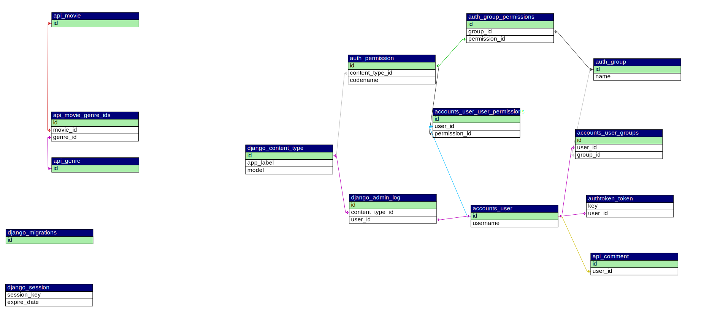

# critiQs
- critiQs is a web application that allows users to view online content descriptions and post their reviews. The app is designed for cinephiles who want to share their thoughts on the latest releases and discover new movies/shows to watch.

- The app features a user-friendly interface, making it easy for users to navigate and find the movies they are looking for. Users can search for movies by title, genre, or year of release. The app also has a recommendation system that suggests movies based on the user's preferences.

- Users can post reviews for movies they have watched, giving them the opportunity to share their thoughts and opinions with others. Each review includes a rating system, where users can rate the movie or a show on a scale of 1 to 5 stars.

- critiQs also include a detailed description of each movie, including the cast, director, release date, and a brief synopsis of the plot. Users can also view trailers, posters, and other related media.

- This web app is a great tool for cinephiles to discover new movies and shows, share their opinions, and stay up to date on the latest releases.


## Get Started Locally


1. Download the Zip:

2. Create a virtual environment for the project:

    ```
    python -m venv venv
    ```

3. Activate the virtual environment:

    - On Mac/Linux:

        ```
        source venv/bin/activate
        ```

    - On Windows:

        ```
        venv\Scripts\activate
        ```

4. Install Django and other required packages:

    ```
    pip install -r requirements.txt
    ```

    - IF YOU GET AN ERROR WHILE INSTALLING `psycopg2`, RUN THE FOLLOWING COMMAND:

        ```
        pip install psycopg2-binary
        ```
    - IF YOU GET AN ERROR WHILE INSTALLING VIA `requirements.txt`, RUN THE FOLLOWING COMMANDS:

        ```
        pip install django drf-yasg requests djangorestframework django-cors-headers
        ```

5. Start the Django app:

    ```
    python manage.py runserver
    ```

You can now access your **critiQs** app at http://127.0.0.1:8000/.

## Tech Stack

- **Frontend**: HTML, CSS, Bootstrap, JavaScript, jQuery
- **Backend**: Django, SQLite
- **APIs**: [TMDb API](https://developers.themoviedb.org/3/getting-started/introduction)
- **Deployment**: Heroku (coming soon)

## Database Schema


